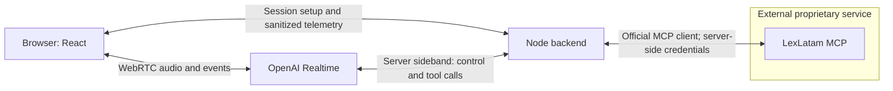

# Realtime voice demo plan

Deliver a two-minute Spanish conversation that retrieves real LexLatam evidence
and speaks a grounded answer. The first milestone is a working end-to-end demo,
with minimal visible state and MCP tool name, status and latency.

## Selected stack

- TypeScript 7.0.2; React 19.3.0; Vite 8.3.0; plain CSS.
- Node.js 24+; Express 5.2.1; official OpenAI SDK 7.15.0.
- OpenAI **Realtime API (GA)**, model `gpt-realtime-2.1`, voice `marin`.
  Browser WebRTC; server-mediated `/v1/realtime/calls` session creation;
  native server VAD. Use Realtime event types consistently.
- Server sideband WebSocket for tool execution and session control in slice 2.
- Official MCP TypeScript SDK: candidate `@modelcontextprotocol/sdk@1.30.0`.
  Pin only after `initialize` and `tools/list` demonstrate interoperability.
- Vitest 5.0.1 for deterministic behavior. One package; no agent framework.

## Architecture and trust boundary

The backend alone executes `search_panama_law` at
`https://app.lexlatam.ai/mcp/`. Discover the deployed schema, validate arguments,
deduplicate tool-call IDs, bound and validate results, and reject stale results
before supplying evidence to the model. No LexLatam code or internal data enters
this repository. Adapt authentication only to its published contract.

## Three milestones

1. **Working demo (2–4 active hours):** confirm access and contracts (15–30 min),
   complete the Spanish voice loop (30–60 min), connect real legal research
   (45–90 min), then show minimal state/tool timing and verify the complete flow
   (30–60 min). Use one implementer and report a runnable checkpoint or a specific
   blocker after each step. Stop for the presenter's test before further work.
2. **Optional barge-in:** assess native WebRTC/VAD interruption first. Add only
   essential stale-turn protection if straightforward. Limit custom work to
   45 minutes; otherwise defer it and document the limitation.
3. **Portfolio polish:** concise README, architecture Mermaid, one screenshot,
   one real latency sample and a two-minute demo script. Stop.

Run typecheck and build, plus trivial tests protecting important deterministic
boundaries. Record live verification separately from fixtures or static checks.
No separate observability, state-machine, concurrency or test-suite projects.

## Definition of done

A real authenticated MCP search supports a spoken Spanish answer. The UI shows
the tool name, success/failure and real measured tool duration. Native interruption
is evaluated separately and is not a prerequisite for the first demo milestone.
Retrieved citation cards use only validated MCP fields. Unsupported answers admit
that available evidence is insufficient; retrieval does not establish legal
validity or applicability. Local checks pass and the presenter can reproduce the
two-minute demo. Optional work must not delay this result.

## Non-goals

No accounts, auth UI, persistence, database, billing, telephony, mobile app,
multiple providers or servers, custom retrieval, orchestration framework,
production deployment, infrastructure changes or LexLatam modifications.
No arbitrary payload logging, credentials in the browser or committed secrets.

## Contract references

- [Realtime API](https://developers.openai.com/api/docs/guides/realtime)
- [WebRTC](https://developers.openai.com/api/docs/guides/voice-webrtc?api=realtime)
- [Server controls](https://developers.openai.com/api/docs/guides/voice-server-controls?api=realtime)
- [MCP TypeScript client](https://ts.sdk.modelcontextprotocol.io/client)
- [LexLatam public MCP](https://www.lexlatam.ai/servidor-mcp-panama)
