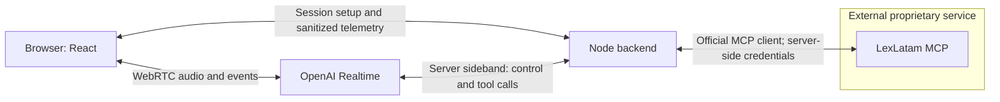

# Realtime voice demo plan

Deliver a two-minute Spanish conversation that retrieves real LexLatam evidence,
speaks a grounded answer, accepts an interruption, and answers a narrower question
without stale speech or tool results resurfacing. Budget: a 1–2 day spike.

## Selected stack

- TypeScript 7.0.2; React 19.3.0; Vite 8.3.0; plain CSS.
- Node.js 24+; Express 5.2.1; official OpenAI SDK 7.15.0.
- OpenAI **Realtime API (GA)**, model `gpt-realtime-2.1`, voice `marin`.
  Browser WebRTC; server-mediated `/v1/realtime/calls` session creation;
  native server VAD. Use Realtime event types consistently.
- Server sideband WebSocket for tool execution and session control in slice 2.
- Official MCP TypeScript SDK: candidate `@modelcontextprotocol/sdk@1.30.0`.
  Pin only after `initialize` and `tools/list` demonstrate interoperability.
- Vitest 5.0.1 for deterministic behavior. One package; no agent framework.

## Architecture and trust boundary

The backend alone executes `search_panama_law` at
`https://app.lexlatam.ai/mcp/`. Discover the deployed schema, validate arguments,
deduplicate tool-call IDs, bound and validate results, and reject stale results
before supplying evidence to the model. No LexLatam code or internal data enters
this repository. Adapt authentication only to its published contract.

## Vertical slices and gates

1. **Plan:** inspect the existing repository and current official contracts;
   save this plan on a clean feature branch.
2. **Voice only:** connect/disconnect, microphone, Spanish speech, basic state
   and recoverable errors. **Gate: a manually verified spoken Spanish round trip.**
3. **Real MCP:** inspect `tools/list`, verify SDK compatibility, implement the
   one-tool boundary and evidence return. **Gate: a recorded live MCP request
   followed by grounded speech.** Preserve guest quota while authentication is
   being developed; any test fixture must be visibly identified.
4. **Barge-in:** native audio interruption plus session/turn/response/call IDs,
   cancellation and stale-event rejection. **Gate: interrupt during speech and
   pending tool work; the new turn succeeds and old output never resumes.**
5. **Observability:** one screen with conversation, source cards, bounded tool
   arguments, status/duration, turn IDs, and interruption events. Use monotonic
   clocks within each process; distinguish playback proxies from audible timing.
6. **Tests:** allowlisting, validation, parsing, duplicate calls, stale results,
   cancellation, timeout and disconnect recovery. No model-wording assertions.
7. **Demo polish:** README, setup, architecture, actual measurements, screenshot,
   recording, two-minute script and engineering tradeoffs after the demo works.

Run typecheck, relevant tests and build for each code slice. Record which gates
were actually verified. Make logical local commits; do not push without explicit
authorization. Keep incomplete verification visible.

## Definition of done

A real authenticated MCP search supports a spoken Spanish answer; interruption
stops old speech and invalidates pending work; a follow-up triggers fresh evidence
and a useful answer. The UI shows the actual requests and measured behavior.
Retrieved citation cards use only validated MCP fields. Unsupported answers admit
that available evidence is insufficient; retrieval does not establish legal
validity or applicability. Focused checks pass and the two-minute demo is recorded.

## Non-goals

No accounts, auth UI, persistence, database, billing, telephony, mobile app,
multiple providers or servers, custom retrieval, orchestration framework,
production deployment, infrastructure changes or LexLatam modifications.
No arbitrary payload logging, credentials in the browser or committed secrets.

## Contract references

- [Realtime API](https://developers.openai.com/api/docs/guides/realtime)
- [WebRTC](https://developers.openai.com/api/docs/guides/voice-webrtc?api=realtime)
- [Server controls](https://developers.openai.com/api/docs/guides/voice-server-controls?api=realtime)
- [MCP TypeScript client](https://ts.sdk.modelcontextprotocol.io/client)
- [LexLatam public MCP](https://www.lexlatam.ai/servidor-mcp-panama)
