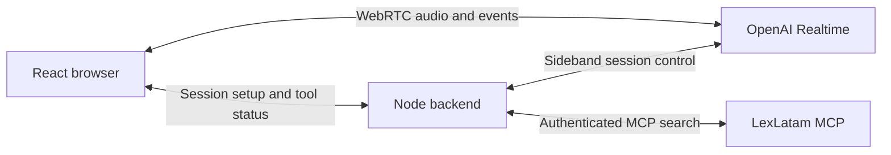

# LexLatam Voice Agent

A small Spanish voice demo connecting OpenAI Realtime to
[LexLatam's public MCP service](https://www.lexlatam.ai/servidor-mcp-panama).
Ask a question about Panamanian law, see the legal-search call and its duration,
and hear a concise answer based on retrieved evidence.

**Verification status:** Live Spanish audio and authenticated legal search still
require verification. Local tests and builds do not establish end-to-end success.

## Run locally

Requires Node.js 24+, an OpenAI API key with access to `gpt-realtime-2.1`, a
LexLatam MCP bearer token, and a browser with microphone access on localhost.
Provider usage may incur charges against the configured accounts.

From the repository root, install the locked dependencies:

```sh
npm ci
```

For a new checkout, create your local configuration:

```sh
cp .env.example .env
```

Fill in `OPENAI_API_KEY` and `LEXLATAM_MCP_TOKEN` in `.env`. The MCP endpoint
defaults to `https://app.lexlatam.ai/mcp/`. Keep credentials server-side; never
prefix them with `VITE_` or commit `.env`.

Start the app, then open [localhost:3001](http://localhost:3001):

```sh
npm run dev
```

Click **Iniciar conversación**, allow the microphone, and ask:
“¿Qué normas regulan las vacaciones anuales de los trabajadores en Panamá?”
The tool panel should show `search_panama_law`, its status and elapsed time.
Check the spoken answer against the returned citations. If evidence is missing
or the search fails, the answer should acknowledge that limitation. Click
**Terminar conversación** to release the microphone and end the session.

## Checks

```sh
npm run typecheck
npm test
npm run build
```

To serve the built frontend locally after a successful build:

```sh
npm start
```

## How it works



The backend executes only `search_panama_law` through the official MCP client.
It validates tool arguments and returned evidence before supplying results to
the voice model. API credentials stay on the backend. Audio goes to OpenAI;
legal-search queries go to LexLatam. The app does not persist conversations.

Sessions end after ten minutes; start another session to continue. This is a
local demo. Retrieved text can be incomplete or outdated, and retrieval
does not establish that an authority applies to a particular case. Native voice
interruption is enabled but has not been evaluated; custom barge-in behavior,
recorded latency samples and presentation polish are deferred until the first
live demo is tested. See [the three-milestone plan](PLAN.md).
