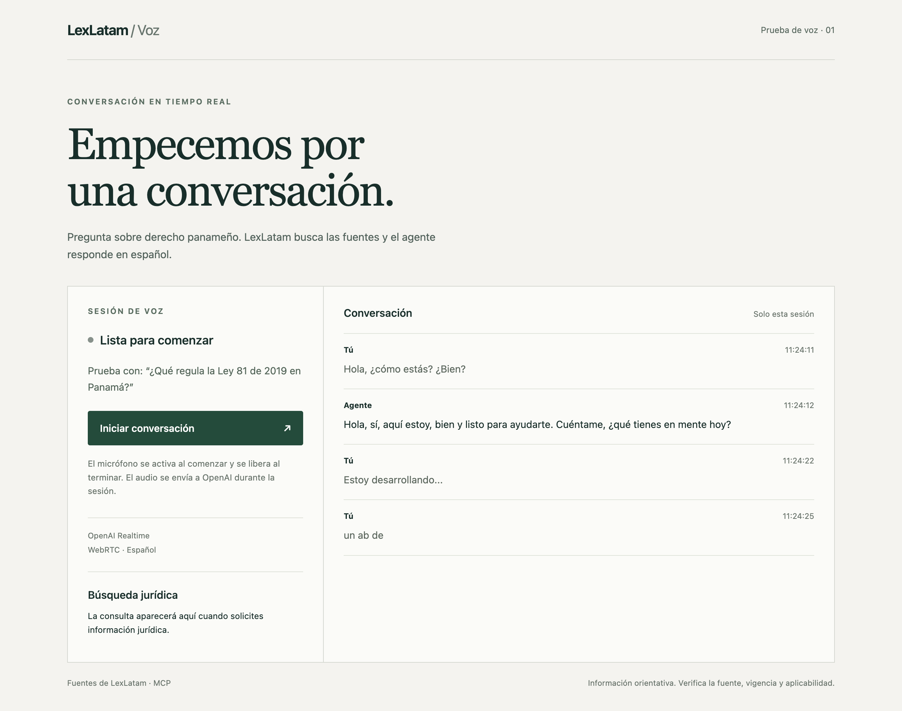
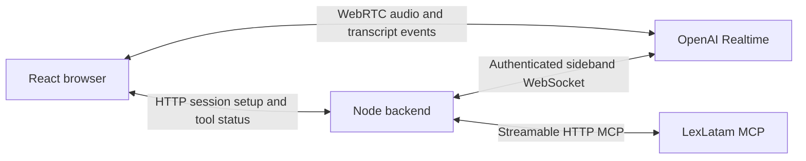

# LexLatam Voice Agent

A small applied-AI demo: a Spanish voice conversation built with React,
WebRTC and OpenAI Realtime, with a server-side tool for searching Panamanian
legal sources through [LexLatam MCP](https://www.lexlatam.ai/servidor-mcp-panama).
The implementation focuses on streaming audio, tool execution, evidence
validation and session cleanup in one TypeScript application.

**Current status — September 16, 2026:** Live Spanish conversation works.
The presenter confirmed the voice demo, and a separate synthetic-audio check
through the application's session API verified transcription and a generated
Spanish audio response. Authenticated MCP initialization and tool discovery
also pass. Legal search through the voice application, a grounded spoken answer
and a measured search-latency sample remain to be validated. Local private-MCP
integration is the next step; this repository is a local demo, not a deployed service.



The conversation remains visible after the session ends. This capture shows
voice interaction; no legal search was triggered.

## Run locally

Requires Node.js 24+, an OpenAI API key with access to `gpt-realtime-2.1`, a
LexLatam MCP bearer token, and a browser with microphone access on localhost.
Provider usage may incur charges against the configured accounts. The current
startup path requires MCP initialization even for a greeting.

From a new checkout, install locked dependencies and create local configuration:

```sh
npm ci
cp .env.example .env
```

Set `OPENAI_API_KEY` and `LEXLATAM_MCP_TOKEN` in `.env` using your editor.
`LEXLATAM_MCP_URL` defaults to `https://app.lexlatam.ai/mcp/`; `PORT` defaults
to `3001`. Credentials stay on the server. Never prefix secrets with `VITE_`,
paste them into review comments, or commit secret files.

Start the app and open [localhost:3001](http://localhost:3001):

```sh
npm run dev
```

For an existing checkout configured with Varlock, use its credential injection
instead of copying secrets into another file:

```sh
npm exec -- varlock run -- npm run dev
```

This alternative assumes Varlock and its secret resolution are already configured
locally; that configuration is not included in this repository. Plain `npm run dev`
loads `.env`, not `.env.local`. Restart after changing server configuration.

## Try the demo

1. Click **Iniciar conversación**, allow microphone access, and wait for
   **Escuchando**. Say “Hola, respóndeme brevemente en español.”
2. Pause after speaking. Your completed turn appears under **Tú**, and the
   response under **Agente**. Listen for the Spanish reply: a transcript alone
   does not verify speaker playback. Text appears after each turn, not word by word.
3. Click **Terminar conversación**. The app returns to **Lista para comenzar**
   and releases the microphone. Starting another session clears the previous transcript.

For the next acceptance check, ask “¿Qué regula la Ley 81 de 2019 en Panamá?”
Expect a real `search_panama_law` call, status and duration, followed by a spoken
answer supported by the returned citations. If evidence is missing or the search
fails, the answer should acknowledge that limitation. This legal-search flow is
implemented but has not yet passed live acceptance in the voice application.

## Architecture



WebRTC carries audio directly between the browser and the voice service. The
Node backend creates the session and uses a separate WebSocket to execute the
single allowed tool, validate results and return evidence to the model. The
browser receives tool status through polling; API credentials never enter the
frontend bundle. The app stores conversation state only in memory.

Read the [architecture walkthrough](docs/architecture.md) for the request flow,
design choices, failure boundaries and a two-minute demo script. The
[three-milestone plan](PLAN.md) tracks the remaining scope.

## Checks

```sh
npm run typecheck
npm test
npm run build
```

Eight deterministic tests cover argument and evidence validation, tool allowlisting,
duplicate and stale calls, MCP startup compatibility, and sideband authentication.
They do not replace live audio or legal-search acceptance. To serve the built
frontend locally, run `npm start` with the same environment configuration.

## Troubleshooting and limits

- **No text:** wait for **Escuchando**, speak, then pause. Check browser microphone
  permission. **Conectando** means the session is not ready to accept a test yet.
- **Setup error:** confirm the configured secret workflow is used and restart the
  server. `/api/status` checks that credentials are present, not that they are valid.
  MCP initialization, voice session creation or sideband attachment can fail setup.
- **Port 3001 already in use:** use the existing server or stop it in its terminal
  before starting another. A frontend reload does not restart the backend.
- Sessions have a ten-minute cap. Native VAD interruption is enabled; interruption
  quality has not been evaluated. Pauses can split a sentence into separate turns.
- The current MCP URL validation requires HTTPS. The local HTTP private-MCP
  contract still needs integration; changing the URL alone will not enable it.
- Retrieved evidence can be incomplete or outdated. It does not establish legal
  validity or applicability. No production hosting, accounts or persistence are included.
