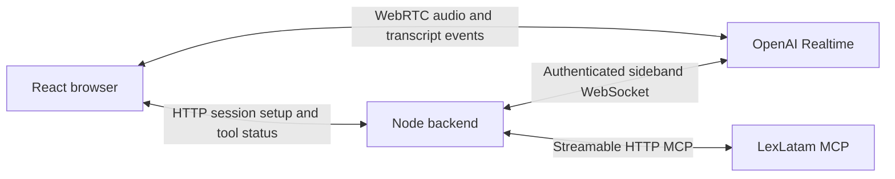

# LexLatam Voice Agent

A small applied-AI demo: a Spanish voice conversation built with React,
WebRTC and OpenAI Realtime, with a server-side tool for searching Panamanian
legal sources through [LexLatam MCP](https://www.lexlatam.ai/servidor-mcp-panama).
The implementation focuses on streaming audio, tool execution, evidence
validation and session cleanup in one TypeScript application.

**Solo project, built in under 24 hours using AI-assisted coding tools.**
That timeframe covers this voice application, which integrates with LexLatam,
my separate, existing legal-research platform. Its proprietary retrieval
implementation stays behind the MCP interface.

**Verified locally — September 16, 2026:** Spanish speech and transcripts,
authenticated legal search with citations, deliberate barge-in, more patient
turn detection, and stopping/restarting without reloading. A live search in the
probation-period demo completed in **4.2 seconds** with three sources; this is one
tool-duration sample, not a voice-latency benchmark. This is a local portfolio
demo, not a deployed service.


The conversation and retrieved evidence remain visible after the session ends.
This capture shows the probation-period demo, a successful `search_panama_law`
call, its measured tool duration and source excerpts with citations.

## Run locally

Requires Node.js 24+, an OpenAI API key with access to `gpt-realtime-2.1`, a
LexLatam MCP bearer token, and a browser with microphone access on localhost.
Provider usage may incur charges against the configured accounts. The current
startup path requires MCP initialization even for a greeting.
The LexLatam backend is a separate prerequisite and is not included in this
repository; running the full demo requires access to that service.

From a new checkout, install locked dependencies and create local configuration:

```sh
npm ci
cp .env.example .env
```

Set `OPENAI_API_KEY` and `LEXLATAM_MCP_TOKEN` in `.env` using your editor.
The MCP token must match the local research server's `MCP_PRIVATE_TOKEN`.
`LEXLATAM_MCP_URL` defaults to `http://localhost/mcp/`; `PORT` defaults
to `3001`. Start the local research server before starting a voice session.
Credentials stay on the server. Never prefix secrets with `VITE_`,
paste them into review comments, or commit secret files.

Start the app and open [localhost:3001](http://localhost:3001):

```sh
npm run dev
```

For an existing checkout configured with Varlock, use its credential injection
instead of copying secrets into another file:

```sh
npm exec -- varlock run -- npm run dev
```

This alternative assumes Varlock and its secret resolution are already configured
locally; that configuration is not included in this repository. Plain `npm run dev`
loads `.env`, not `.env.local`. Restart after changing server configuration.

If an existing secret workflow still selects the deployed MCP endpoint, keep its
token configuration and override only the endpoint for the local run:

```sh
npm exec -- varlock run -- env LEXLATAM_MCP_URL=http://localhost/mcp/ npm run dev
```

`localhost` refers to the process making the MCP request. When the voice backend
runs in Docker Desktop on the same Mac, use `http://host.docker.internal/mcp/`
to reach the host. Other remote endpoints require HTTPS. Deployment and private
access on stage or production are not part of this demo's verified setup.

## Try the demo

1. Click **Iniciar conversación**, allow microphone access, and wait for
   **Escuchando**. Say “Hola, respóndeme brevemente en español.”
2. Pause after speaking. Your completed turn appears under **Tú**, and the
   response under **Agente**. Listen for the Spanish reply: a transcript alone
   does not verify speaker playback. Text appears after each turn, not word by word.
3. Click **Terminar conversación**. The app returns to **Lista para comenzar**
   and releases the microphone. Starting another session clears the previous transcript.

To demonstrate legal research, ask “Según el Código de Trabajo de Panamá, ¿qué
puede hacer cualquiera de las partes durante el período probatorio?” Follow up
with “¿Cuánto puede durar ese período? ¿Tiene que constar expresamente en el
contrato escrito?” Then interrupt the reply: “Espera, disculpa. ¿Qué pasa si el
trabajador ya había ocupado esa misma posición en la misma empresa?”

Expect a real `search_panama_law` call, status and duration, followed by a spoken
answer supported by the returned citations. If evidence is missing or the search
fails, the answer should acknowledge that limitation. This sequence has been
exercised live; retrieved-source quality remains a dependency
of the research service, and the voice agent must accurately convey its limits.

## Architecture



WebRTC carries audio directly between the browser and the voice service. The
Node backend creates the session and uses a separate WebSocket to execute the
single allowed tool, validate results and return evidence to the model. The
browser receives tool status through polling; API credentials never enter the
frontend bundle. The app stores conversation state only in memory.

Read the [architecture walkthrough](docs/architecture.md) for the request flow,
design choices, failure boundaries and a two-minute demo script. The
[three-milestone plan](PLAN.md) records the completed scope.

## Checks

```sh
npm run typecheck
npm test
npm run build
```

Deterministic tests cover argument and evidence validation, tool allowlisting,
duplicate and stale calls, MCP startup compatibility, and sideband authentication.
Additional transport tests cover local endpoints, bearer headers, failed
authentication, MCP tool errors and the 120-second HTTP deadline.
They do not replace live audio or legal-search acceptance. To serve the built
frontend locally, run `npm start` with the same environment configuration.

## Troubleshooting and limits

- **No text:** wait for **Escuchando**, speak, then pause. Check browser microphone
  permission. **Conectando** means the session is not ready to accept a test yet.
- **Setup error:** confirm the configured secret workflow is used and restart the
  server. `/api/status` checks that credentials are present, not that they are valid.
  MCP initialization, voice session creation or sideband attachment can fail setup.
- **Port 3001 already in use:** use the existing server or stop it in its terminal
  before starting another. A frontend reload does not restart the backend.
- Sessions have a ten-minute cap. Native semantic turn detection uses low
  eagerness to allow thinking pauses. It may take longer to respond when a turn
  sounds unfinished. Deliberate barge-in and the adjusted pacing have been
  accepted in live testing; native detection can still misjudge a pause.
- MCP permits HTTP for loopback and `host.docker.internal`, and HTTPS for remote
  endpoints. Requests carry a bearer token; authentication failures never retry
  anonymously. A successful HTTP status can still contain an MCP tool error.
  Search requests have a 120-second deadline, including HTTP response-body reads.
- Retrieved evidence can be incomplete or outdated. It does not establish legal
  validity or applicability. No production hosting, accounts or persistence are included.
